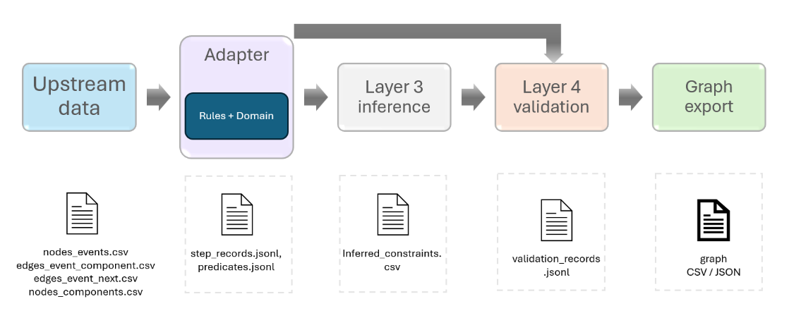

# Grounded Assembly Reasoning For IndustReal

This repository contains the public thesis demo for a four-layer grounded
assembly reasoning pipeline over IndustReal assembly data.

The thesis project was developed by two contributors. Layers 1 and 2 transform
raw IndustReal evidence into graph CSV artifacts suitable for downstream
reasoning. Those upstream data-processing layers were implemented by my thesis
partner. This repository includes a small public CSV fixture from that boundary
so the reasoning pipeline can be executed without redistributing the full raw
dataset workflow.

My contribution is the reasoning layer stack:

- Layer 3: converts upstream graph events into symbolic step records and
  predicates, then infers procedural constraints from configurable rules.
- Layer 4: validates inferred constraints over step history, tracks effect
  lifecycle, and builds a procedural reasoning graph with traceable evidence.



*Implemented pipeline. Each stage creates explicit artifacts, so the reasoning
process can be inspected before the next stage consumes the output.*

## Pipeline Boundary

The executable demo starts from exported IndustReal graph CSVs:

```text
results/neo4j/raw_cad_dataset__all_test_clips/
```

These CSVs are the output boundary of Layers 1 and 2. The demo then generates
the reasoning artifacts:

```text
graph CSVs
  -> step_records.jsonl + predicates.jsonl
  -> inferred_constraints.csv
  -> validation_records.jsonl + diagnostics
  -> procedural_reasoning_graph.json/csv
```

## Quick Start

Create and activate a Python environment, then install the lightweight demo
dependencies:

```bash
pip install -r requirements.txt
```

Generate reasoning artifacts for all clips in the included graph CSV fixture:

```powershell
.venv\Scripts\python.exe scripts\25_rebuild_all_reasoning_and_import_neo4j.py `
  --run-id raw_cad_dataset__all_test_clips `
  --csv-dir results\neo4j\raw_cad_dataset__all_test_clips `
  --skip-import
```

This command reads every `clip_result_id` in
`results\neo4j\raw_cad_dataset__all_test_clips\nodes_events.csv` and generates
the Layer 3 and Layer 4 reasoning outputs plus procedural reasoning graphs for
those clips. The command writes reasoning artifacts under:

```text
results/reasoning_layers/
results/procedural_reasoning_graph/
```

`--skip-import` keeps the demo local and does not require Neo4j credentials.
Script `18_import_procedural_reasoning_graph_neo4j.py` can import a generated
procedural graph into Neo4j when credentials are available.

## Key Files

```text
config/thesis_rules.yaml
config/domain_config.yaml
config/reasoning_adapter.yaml
src/layer3_reasoning_adapter.py
src/layer3_inference.py
src/layer4_validation.py
src/procedural_reasoning_graph.py
scripts/14_build_layer3_reasoning_adapter.py
scripts/15_run_layer3_inference.py
scripts/16_run_layer4_validation.py
scripts/17_build_procedural_reasoning_graph.py
scripts/25_rebuild_all_reasoning_and_import_neo4j.py
```

## Documentation

- `docs/raw_cad_pipeline_explanation.md` explains the upstream IndustReal raw
  evidence pipeline and its oracle-first design.
- `docs/industreal_neo4j_guide.md` explains the graph CSV and Neo4j export
  structure used as the reasoning input boundary.
- `docs/reasoning_layers/current_pipeline_integration.md` explains how Layers
  3 and 4 connect to the upstream graph artifacts.

## Related Thesis

This repository accompanies the thesis:

```bibtex
@masterthesis{Marquez_2026,
  series={IT},
  title={Knowledge-Driven Validation of Procedural Steps for XR-Based Industrial Assembly},
  url={https://urn.kb.se/resolve?urn=urn:nbn:se:uu:diva-591569},
  author={Márquez, Eric},
  year={2026},
  collection={IT}
}
```

## Credits

This thesis pipeline was developed as a two-person project.

Layers 1 and 2, which transform raw IndustReal evidence into graph CSV
artifacts, were implemented by my thesis partner in the upstream project:
[XR_Event_Grounding_Graph](https://github.com/cedrickaneza/XR_Event_Grounding_Graph).

This repository focuses on my contribution: Layers 3 and 4, which transform
those graph artifacts into symbolic step records, inferred procedural
constraints, validation traces, and procedural reasoning graphs.

## Citation / Data Source

This repository is an independent thesis demo built on public
IndustReal-derived graph artifacts; it is not affiliated with or maintained by
the original IndustReal authors.

If you use this demo or the included IndustReal-derived artifacts, please cite
the original IndustReal dataset paper:

```bibtex
@inproceedings{schoonbeek2024industreal,
  title={IndustReal: A Dataset for Procedure Step Recognition Handling Execution Errors in Egocentric Videos in an Industrial-Like Setting},
  author={Schoonbeek, Tim J and Houben, Tim and Onvlee, Hans and van der Sommen, Fons and others},
  booktitle={Proceedings of the IEEE/CVF Winter Conference on Applications of Computer Vision},
  pages={4365--4374},
  year={2024}
}
```

## Scope

This public repository intentionally excludes private pilot-study data and
human-judgement experiment packets. It is intended to show the thesis reasoning
pipeline and a minimal reproducible public demo, not the full private research
archive.
