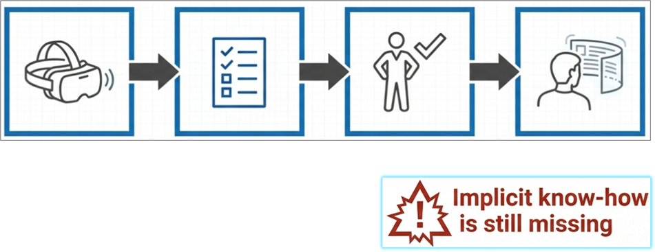
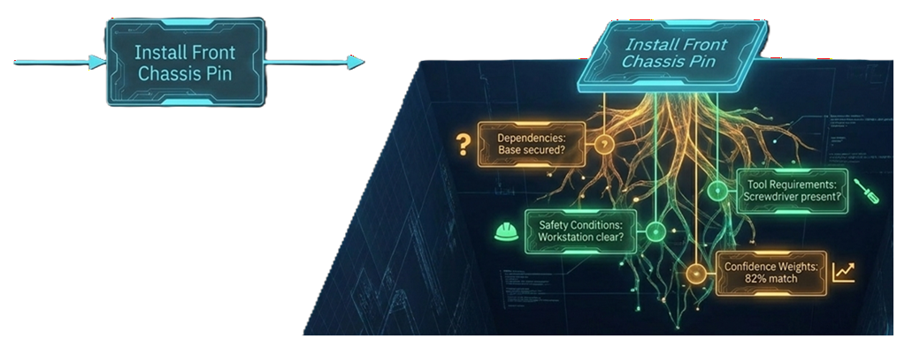
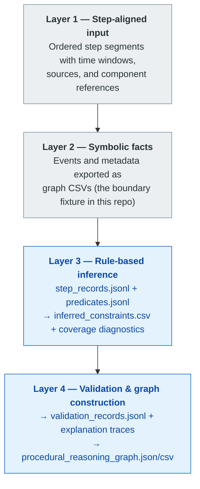
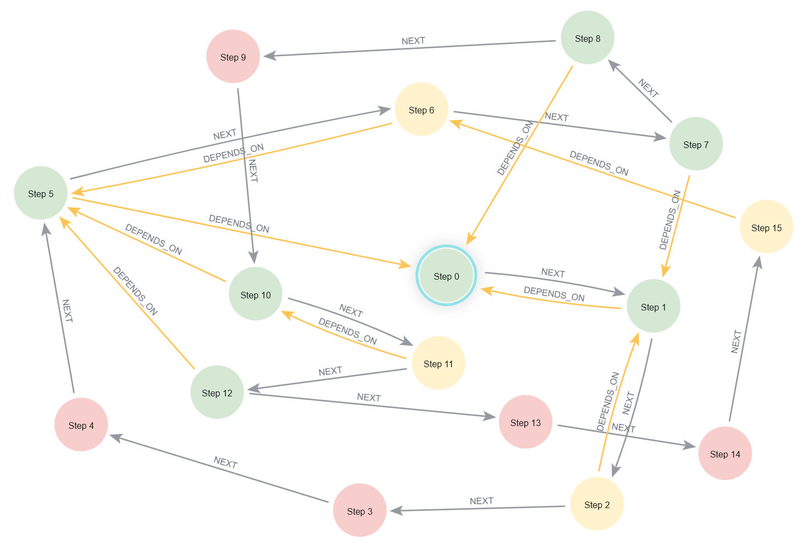
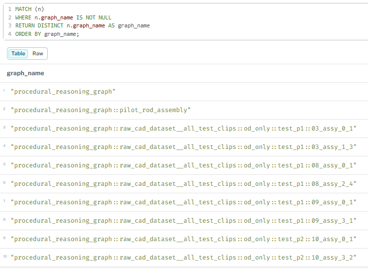
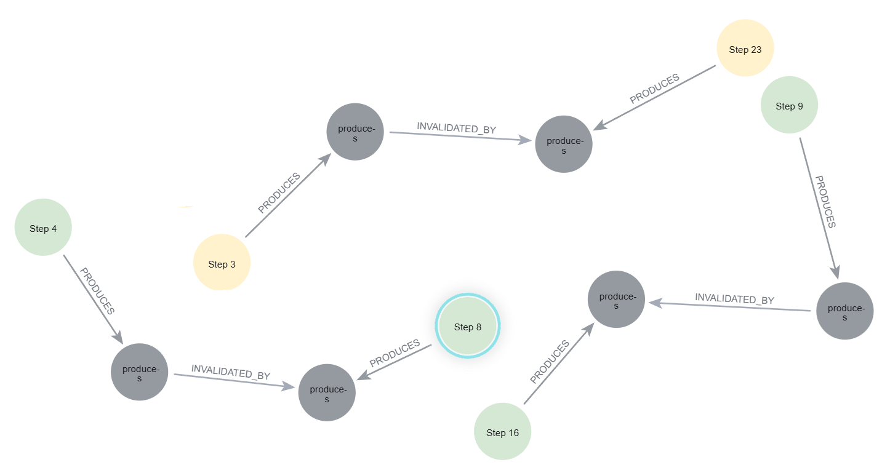
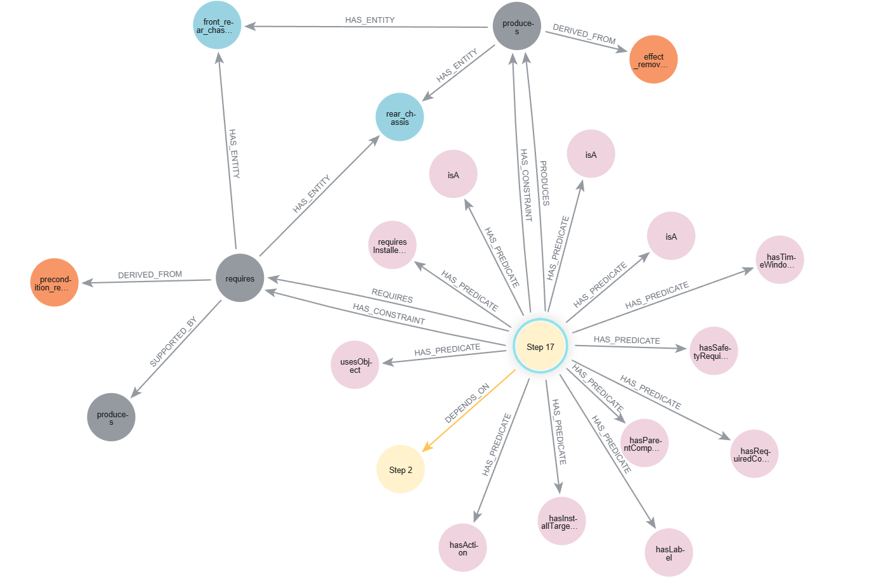
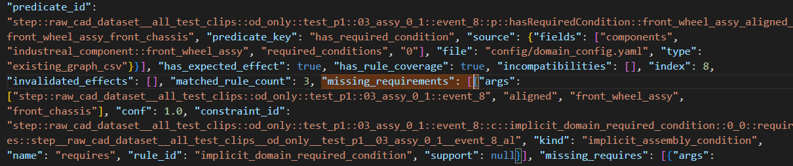

# Grounded Assembly Reasoning for XR-Based Industrial Assembly

**A symbolic reasoning layer that turns AI-derived assembly observations into validated, explainable procedural knowledge — every accept/reject decision traceable back to the evidence that produced it.**

Perception models and XR systems can tell you *what* an operator appears to be doing. They cannot tell you whether the step is procedurally valid — whether its preconditions hold, which earlier step enables it, whether a required tool or safety condition is missing, or whether the evidence is even trustworthy. This pipeline answers those questions over real assembly data (IndustReal), classifies every step as **accepted / uncertain / rejected**, and exports the full reasoning trace as a queryable knowledge graph.

Developed as the reasoning contribution of a master's thesis at Uppsala University:
*Knowledge-Driven Validation of Procedural Steps for XR-Based Industrial Assembly* ([DiVA_Link](https://urn.kb.se/resolve?urn=urn:nbn:se:uu:diva-591569)).

> [!NOTE]
> This was a two-person thesis project. **Layers 1–2** (raw IndustReal video → graph CSV artifacts) were built by my thesis partner in [XR_Event_Grounding_Graph](https://github.com/cedrickaneza/XR_Event_Grounding_Graph). **This repository is my contribution: Layers 3–4** — the symbolic reasoning, validation, and knowledge-graph stack — plus a public CSV fixture from the layer boundary so the pipeline runs end-to-end without the private upstream workflow.

## The Problem

Industrial assembly assistance is moving toward XR headsets and AI perception, but what those systems capture is typically a **flat list of recognized steps** — descriptive, not procedural. 



> Knowledge capture today: This captures what the expert did, but not yet why each step is valid, required, or safe. 


A flat step list cannot answer the questions that matter in safety-sensitive manufacturing:

- **Why is this step valid here?** What must already hold before it?
- **What does it depend on?** Which earlier step enables it — and is that step still trustworthy?
- **What's missing?** An omitted tool, an unstated safety condition, an unaligned part?
- **How sure are we?** Perception evidence is noisy; treating it as ground truth is how guidance systems lose operator trust.

XR authoring systems generate instructions but don't validate them; step-recognition models detect procedural progress but not procedural *support*; ontology-based assembly models assume clean, deterministic inputs. None connect uncertain observation-derived evidence to **traceable validation decisions**. This project fills that gap.



> Before/after: The idea is take a flat input step list and enrich with previous actions, tools, safety conditions, object compatibility, and missing evidence. 

## System Architecture

The core commitment: *no black boxes between evidence and decision*. Observations become symbolic predicates with confidence and provenance; configurable rules infer what each step requires and produces; ordered validation classifies each step against evidence and the effects of earlier non-rejected steps; and everything is exported as an inspectable graph.

Full design detail: [docs/architecture.md](docs/architecture.md) · [Integration notes](docs/reasoning_layers/current_pipeline_integration.md)

## Solution: The Reasoning Pipeline

Each layer reads explicit file artifacts from the previous one and writes its own — no hidden state, every intermediate inspectable:



- **Layers 1–2** *(upstream)*: segment recordings into ordered candidate steps and export them as structured graph CSVs.
- **Layer 3** *(this repo)*: an adapter normalizes the CSVs into confidence-weighted predicates; a generic rule engine (11 rules in config, not code) infers preconditions, expected effects, tool/safety requirements, and hard incompatibilities.
- **Layer 4** *(this repo)*: walks the ordered steps maintaining a produced-effect history, checks every requirement against active evidence, assigns statuses with explanation traces, and builds the procedural reasoning graph.




> Procedural graph constructed from validated step records of one Industreal clip. The *NEXT* edges preserve the input sequence, while *DEPENDS_ON* edges make explicit how requirements are satisfied by effects produced by earlier steps. Node status and attached evidence indicate whether each step is accepted (blue), uncertain (yellow), or rejected (red)


## Quick Start

Runs in minutes on the included public fixture (38 clip results, 659 assembly events from IndustReal). Requires Python 3; the only heavyweight dependency is the optional Neo4j driver.

<!-- TODO animated GIF: ~10s screen capture — run script 25, watch artifacts appear, open Neo4j Browser, run one Cypher query on a Step node. Suggested file: docs/images/demo.gif -->
> 🎬 *Placeholder — 10-second GIF: run the pipeline → open Neo4j → query a step's reasoning trace (`docs/images/demo.gif`)*

```bash
pip install -r requirements.txt
```

```powershell
python scripts\25_rebuild_all_reasoning_and_import_neo4j.py `
  --run-id raw_cad_dataset__all_test_clips `
  --csv-dir results\neo4j\raw_cad_dataset__all_test_clips `
  --skip-import
```

This discovers every clip in the fixture and generates all reasoning artifacts under `results/reasoning_layers/` and `results/procedural_reasoning_graph/`. Drop `--skip-import` (with `NEO4J_URI` / `NEO4J_PASSWORD` in `.env`) to also load the graphs into Neo4j. Run the tests with `pytest`.

Once imported, you may run this query to get the names of the graphs imported into neo4j:

<!--```cypher
MATCH (n)
WHERE n.graph_name IS NOT NULL
RETURN DISTINCT n.graph_name AS graph_name
ORDER BY graph_name;
```-->


> Neo4j Browser with the query above and its result table/graph


## Key Features

- **Three-way validation** — steps are `accepted`, `uncertain`, or `rejected`; uncertainty is preserved, not rounded away, and dependencies on uncertain steps are marked `provisional`.
- **Effect lifecycle tracking** — produced effects are `active`, `invalidated` (e.g., by a later removal), or `inactive_rejected`; history is kept for audit, but only active effects can support later steps.
- **End-to-end provenance** — status → constraint → rule → predicates → upstream CSV field, with SHA-256 config/input hashes embedded in every exported graph.
- **Dependency inference** — `DEPENDS_ON` edges exist only when a requirement is grounded in an earlier step's produced effect; temporal `NEXT` order is never confused with procedural dependency.
- **Deterministic and config-driven** — same inputs + same config = same outputs; rules and domain knowledge (versioned, with ADRs and a changelog) change without touching engine code.



> A sample of produced-effect constraints linked by *INVALIDATED\_BY* relations to later removal effects.


> Compact explanation neighborhood for a representative Step, showing evidence and provenance links.

## Repository Structure

<details>
<summary><b>Expand: folder-by-folder overview</b></summary>

```text
config/                 Declarative knowledge — the "what" separated from the "how"
  thesis_rules.yaml       Predicate vocabulary, aliases, 11 inference/compatibility rules,
                          thresholds (versioned: rule_set_version 1.3.0)
  domain_config.yaml      IndustReal components mapped to a 10-type hierarchy, install targets,
                          tools, conditions (versioned: domain_model_version 1.3.0)
  observation_contract.yaml  Canonical fields for observed installation targets + fallback policy
  reasoning_adapter.yaml  Runtime defaults: paths, run ids, expected CSV filenames

src/                    Reasoning engine (~3.7k lines, stdlib + PyYAML)
  layer3_reasoning_adapter.py   Upstream CSVs → step records + symbolic predicates
  layer3_inference.py           Rule matching, binding, confidence aggregation
  layer4_validation.py          Ordered validation, effect lifecycle, explanation traces
  procedural_reasoning_graph.py Graph construction with provenance manifest
  procedural_neo4j_import.py    Idempotent per-graph Neo4j import

scripts/                Thin CLI wrappers per pipeline stage (14–18) + batch runner (25)
tests/                  22 pytest tests: validation semantics, ontology config, graph, import
results/neo4j/          Public input fixture: graph CSVs for 38 clip results
docs/
  architecture.md               System design and data contracts
  evaluation.md                 What was evaluated, how, and findings
  reasoning_layers/
    current_pipeline_integration.md   Full integration reference
    decisions/                        Architecture Decision Records (ADR-001…004)
    domain_rule_changelog.md          Semantically versioned rule/domain changelog
    Evaluation1…5/                    Per-evaluation evidence reports
```

</details>

## Technologies

| Purpose | Choice | Why |
|---|---|---|
| Language | Python 3 (stdlib-first, ~3.7k LOC) | Reasoning is I/O + logic; no framework needed |
| Configuration | YAML/JSON (`PyYAML`) | Rules and domain knowledge as reviewable, versioned data |
| Knowledge graph | Neo4j (official driver) | Post-hoc inspection and Cypher queries over reasoning traces |
| Interchange | JSONL + CSV artifacts | Stage boundaries that are diffable, greppable, and testable |
| Testing | pytest (22 tests) | Validation semantics locked down against regressions |

Deliberately absent: no ML framework, no rule-engine dependency, no ORM. The reasoning core needed to be small enough to verify by reading.

## Implementation Highlights

The "why" behind the design, in one line each — full rationale in [docs/architecture.md](docs/architecture.md) and the [ADRs](docs/reasoning_layers/decisions/):

- **Rules over learning** — the goal is not just inferring constraints but *explaining where they came from*; deterministic and inspectable beats broader coverage here.
- **A constraint layer between evidence and validation** — conditions like "holes aligned before tightening" are never observed; separating predicates from inferred constraints keeps stated vs. inferred always distinguishable.
- **Generic rules + declarative domain config** — the engine never mentions a specific component; porting to a new assembly means writing config, not code.
- **Declared ≠ satisfied** — a configured requirement is never accepted as evidence of its own satisfaction, eliminating a whole class of circular validation bugs.
- **Conservative min-confidence** — a constraint is only as trustworthy as its weakest evidence; simpler than probabilistic inference and auditable to the digit.
- **Neo4j downstream of reasoning** — graph storage is inspection, never a dependency of validation semantics.

## Validation

Five functional evaluations, each falsifiable — methodology, numbers, and limitations in [docs/evaluation.md](docs/evaluation.md):

| Evaluation | Question | Outcome |
|---|---|---|
| 1 · Artifact consistency | Is every stage inspectable, with no hidden state? | Pass — and it exposed a real rule-coverage gap (see Lessons) |
| 2 · Inference coverage | Does Layer 3 enrich rather than relabel? | 6,568 predicates → 1,673 constraints across 38 clip results |
| 3 · Validation behavior | Are constraints used consistently to decide? | 5/5 behaviors pass (support, rejection, isolation, invalidation, thresholds) |
| 4 · Graph traceability | Can decisions be followed in the graph? | 9/9 structural checks pass on a real 500-node clip graph |
| 5 · Symbolic robustness | Does it fail conservatively under corrupted evidence? | 5/5 perturbations degrade conservatively with traces preserved |




> A real explanation trace: an excerpt of one step's status, evidence, and missing requirement (`results\reasoning_layers\raw_cad_dataset__all_test_clips__od_only__test_p1__03_assy_0_1\validation_records.jsonl`)

**Scope honesty:** this is a functional evaluation over oracle-derived symbolic inputs — it does not claim perception accuracy or expert-validated assembly correctness.

## Lessons Learned

- **File-based stage boundaries were the highest-leverage decision** — they made debugging local, made the evaluations possible, and let two theses integrate through contracts alone.
- **Evaluation found a real semantic gap, and the process handled it** — `remove` actions initially had evidence but no semantics; the gap surfaced as a `no_applicable_rule` diagnostic, became the effect-lifecycle feature, and is documented in `Evaluation1_remove_semantics/` and the ADRs.
- **Uncertainty as a first-class status beats forced binary decisions** — it is what makes conservative degradation possible.
- **Trade-off accepted:** scalar min-confidence can't model evidence dependencies, but it's explainable in one sentence — right call for a traceability-first system.
- **Known bottleneck:** the domain model is hand-authored; generating it from CAD metadata is the obvious next step.
- **What I'd redesign:** build the provenance manifest (config/input hashes) in from day one, and pin down the upstream observation contract earlier — renegotiating it mid-project was absorbable but expensive.

## Future Work

**Research directions**

- Feed the reasoning layer VLM-generated perception outputs instead of oracle-style predicates and measure how validation grounds them.
- Benchmark the rule base against expert judgment on labeled correct/faulty executions.
- LLM explanation interface: answer "why was this step rejected?" from graph evidence rather than model priors.

**Engineering extensions**

- Generate the domain config from CAD metadata or assembly documentation.
- Drive runtime XR operator feedback from validation status, missing requirements, and dependency traces.

## Citation

```bibtex
@masterthesis{Marquez_2026,
  series={IT},
  title={Knowledge-Driven Validation of Procedural Steps for XR-Based Industrial Assembly},
  url={https://urn.kb.se/resolve?urn=urn:nbn:se:uu:diva-591569},
  author={Márquez, Eric},
  year={2026},
  collection={IT}
}
```

This repository is an independent thesis demo built on public IndustReal-derived artifacts and is not affiliated with the IndustReal authors. If you use the included artifacts, please cite the original dataset:

```bibtex
@inproceedings{schoonbeek2024industreal,
  title={IndustReal: A Dataset for Procedure Step Recognition Handling Execution Errors in Egocentric Videos in an Industrial-Like Setting},
  author={Schoonbeek, Tim J and Houben, Tim and Onvlee, Hans and van der Sommen, Fons and others},
  booktitle={Proceedings of the IEEE/CVF Winter Conference on Applications of Computer Vision},
  pages={4365--4374},
  year={2024}
}
```

## Credits, Scope & License

Two-person thesis project: Layers 1–2 by my thesis partner ([XR_Event_Grounding_Graph](https://github.com/cedrickaneza/XR_Event_Grounding_Graph)); this repository contains my contribution, Layers 3–4. It intentionally excludes private pilot-study data and human-judgement experiment packets; the evaluation *reports* ship under `docs/reasoning_layers/`, while the evaluation runner scripts live in the private research archive.

Released under the **Apache License 2.0**. The included IndustReal-derived artifacts remain subject to the original IndustReal license and citation requirements.
